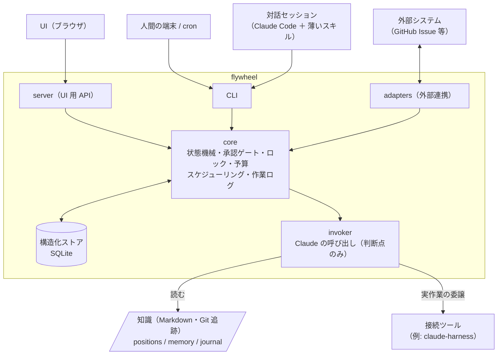
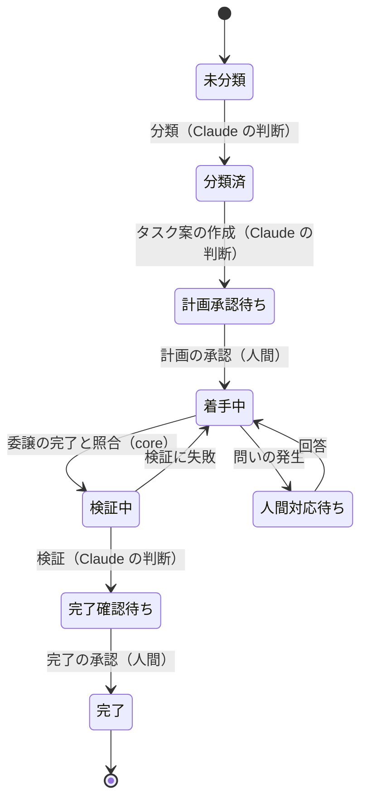

# flywheel アーキテクチャ設計

- 状態: **確定**（2026-09-20 に `main` へマージ＝flywheel#1）。2026-09-21 の決定（D12〜D16）を反映済み。実装には未着手
- 起草: 2026-09-20
- M1 の機能仕様: [docs/features/m1-core.md](features/m1-core.md)
- 経緯: [claude-flywheel#99](https://github.com/masanami/claude-flywheel/issues/99)（方針変更と前提決定の記録）

> **この文書の読み方** — 各項目には確度を付けている。
> **【決定】** 人間が決めた事項（日付つき）。**【仮定】** 起草者が推奨として置いたもの。異論が無ければそのまま進む。**【未決】** 人間の判断が要るもの（§16 にまとめてある）。

---

## 1. 背景: 何を解くのか

flywheel は、自律エージェントが課題を取り込み、計画し、実作業を委譲し、検証し、学習するサイクルを回す仕組みである。現在は Claude Code プラグイン（`claude-flywheel`）と、読み取り中心の UI（`claude-flywheel-board`）の 2 つで構成されている。

### 1.1 解きたい課題【決定 2026-09-20】

1. **Claude を必要としない処理まで Claude が実行しており、無駄にコストがかかる。** スクリプト化で改善はされたが、スクリプトを呼ぶのは依然として LLM セッションである。
2. **UI をシステムに含めたい。ただし Markdown をデータソースにすると UX に限界がある。**
3. **現状の管理はユーザーの認知力を要求する。** UI/UX による支援が今後重要になる。
4. したがって**データの持ち方を含めて**作り直す。**UI からの状態変更**と**外部システムとの連携**も射程に入れる。

### 1.2 実測による裏付け

**散文は個別の是正では減らない。** `run-cycle/SKILL.md` は 73,598 B（2026-08-20）から **130,145 B**（2026-09-14）へ 77% 増えた。この間に「分量と散文で持つべき規定の範囲を見直す」課題（claude-flywheel#97）が完了しているにもかかわらず、である。

**散文の大半は、判断ではなく制御である。** 現行 `run-cycle` の手順別の分量と中身（2026-09-14 時点）:

| 手順 | 分量 | 中身の実態 |
|---|---:|---|
| 0. 観測・取り込み | 15.1 KB | ロック取得・heartbeat・外部ソースの取り込み・fingerprint 照合。**ほぼ全部が決定的** |
| 1. 整理 | 9.2 KB | 課題が自ポジションのものかの分類。**判断** |
| 2. 計画 | 18.3 KB | タスク案の作成は**判断**。予算・枠・直列化グループの算出は**決定的** |
| 3. 実行 | 51.9 KB | 依存ゲート・スロット割り当て・費用ガードの評価式・枠超過の伝播・起動と合流・イベント記録・結果の照合。**大半が決定的**。判断は「ブリーフを書く」「子の問いに答える」の 2 つ |
| 4. 検証 | 4.3 KB | 成果が完了条件を満たすかの**判断** |
| 5. 学習 | 0.8 KB | 知見の記録。**判断** |
| 6. 報告・コミット | 26.6 KB | バリデータ・pathspec コミット・未終了イベントの検算・ロック解放。**ほぼ全部が決定的** |

**コンテキストの固定費が構造的に大きい。** 1 サイクルごとに約 66k トークンの固定文脈を読み、さらに 1 セッションで複数周回すと親のトークンが二乗的に積み上がる（実測: 親 1,793 ターンでキャッシュ読み 8 億トークン）。現在は「1 サイクル = 1 セッション」という運用規律で抑えている。

**Markdown 正本は UI 側にもコストを払わせている。** board は 38,706 行のうち **7,229 行が Markdown のパース層**である。書き込みは「承認チェックボックス 1 行の置換」だけが許可された唯一の経路で、優先度の並べ替え・新規起票・人間記入欄の編集は実装できないまま止まっている。

**運用者は実際に迷っている。** 1 か月の運用で繰り返し迷った点として、次の 5 つが報告されている（claude-flywheel#111）。本設計が UI/UX で解消すべき認知負荷の実例として扱う（対応は §12.3）。

1. サイクルを回すのか、対話で指示するのか
2. 承認はいつ・どこで行うのか
3. 「サイクルの終わり」と「仕事の終わり」がずれる
4. 1 セッションで何周回してよいのか
5. 定期実行と都度実行のどちらが標準か

---

## 2. 決定済み事項

| # | 決定 | 日付 |
|---|---|---|
| D1 | 「当面プラグイン継続・実装しない」を撤回し、**システム化へ移行する** | 2026-09-20 |
| D2 | **新設リポジトリ（本 repo）で作り直す。** 旧 2 repo（claude-flywheel / claude-flywheel-board）は切り替えまで**保守モード**（日々の運用に必要な修正のみ） | 2026-09-20 |
| D3 | **状態の正本は構造化ストア**にする。board 側の既存決定「正本はファイルベース維持・DB 化は不採用」を覆す | 2026-09-20 |
| D4 | **Git による監査性は重視しない。作業ログが分かれば足りる** → イベントソーシングは採らない | 2026-09-20 |
| D5 | **GitHub 上でのチェックボックス承認は廃止。承認は人間が直接行う操作に限る**（UI と、端末での対話的な確認を伴う CLI）。当初は「AI への指示による承認（対話で『承認して』）を維持」としたが、自己承認を防ぐ仕組みが複雑かつ不完全になるため、同日のレビューで外した（§9） | 2026-09-20（同日改訂） |
| D6 | 既存データの移行は**システムの形が固まってから検討**する。方向は一括移行 | 2026-09-20 |
| D7 | **flywheel はドメイン非依存の自律エージェント**であり、開発特化の接続ツール（claude-harness 等）を取り込まない。接続ツールは**エージェントの立ち上げ時に指定**する | 2026-09-20 |
| D8 | claude-harness の配布形態（プラグインか CLI か）は **harness 側が単独で決める**。flywheel の決定を待たない（claude-harness#201） | 2026-09-20 |
| D9 | **ストアはエージェントごとに持つ**（ワークスペース内に 1 ファイル）。エージェント横断の表示は UI が複数のストアを束ねて行う | 2026-09-20 |
| D10 | **ストアは Git で追跡しない。復旧のために、JSON の書き出しを定期的にコミットする**（監査のためではない＝D4） | 2026-09-20 |
| D11 | **個別操作を基本にし、サイクルは「進められるものを全部進める」一括操作として残す** | 2026-09-20 |
| D12 | **完了の承認と本番反映の承認は、人の 1 回の操作で両方を承認し、作業ログには別々の記録として残す。** モデル上のゲートは 3 つ（計画・完了・本番反映）のまま持つ。「完了だけ承認して、本番反映は保留」も選べる（§9） | 2026-09-21 |
| D13 | **配布は当面、オーナー自身の環境だけ**（Q7 を決定）。公開パッケージ化・他者への配布は M5 の後に判断する。ただし**環境固有のパスをコードへ埋めない**ことは最初から守る | 2026-09-21 |
| D14 | **バックエンド（core・CLI・server・invoker・adapters）は Go、フロントエンド（UI）は React / TypeScript。** SQLite は C コンパイラ不要の実装を使い、バイナリ 1 つで配れる形にする。§4 の構成は変わらない（変わるのは §15 だけ）。claude-harness の runtime（claude-harness#201）と言語はそろうが、**コードは共有しない**（D7・D8） | 2026-09-21 |
| D15 | **モバイルからも UI へアクセスできるようにする（要件の追加）。** UI の主たる形はブラウザ UI になる。端末の外から届く経路と、その経路での本人確認・承認をどこまで開くかは **M4 の設計課題**として未決（§12.4・Q9） | 2026-09-21 |
| D16 | **UI はブラウザ UI で始める。** デスクトップアプリ化・モバイルアプリ化は、ブラウザでは対応できないことが実際に出てきた時点で検討する。そのため UI は「API を呼ぶ React」として作る | 2026-09-21 |

D3 について。board 側の不採用理由は 3 つあったが、いずれも本構成には当てはまらない。「エージェントは Read/Edit がネイティブ」は Claude が状態を直接読み書きする前提の話であり、それ自体が §1.1 の課題 1 である。「DB 正本はサーバ常時稼働が必須」「cron のサイクルを巻き込む」は、組み込み DB（SQLite）なら成立しない。

---

## 3. 設計原則

**P1. 制御の主従を反転する。** 現在は Claude がスクリプトを呼んでいる。これを、**システムが回り、判断が要る箇所でだけ Claude を呼ぶ**形にする。

**P2. 状態の書き込み経路は core の 1 本だけ。** UI・CLI・外部連携・Claude のいずれも、状態を変えるときは同じ core を通る。状態遷移の検証と承認ゲートを、散文の約束ではなくコードの分岐にする。

**P3. データを性質で分ける。** 機械が遷移させ、UI が問い合わせ、外部と同期するものは構造化ストアに置く。LLM が読む知識は Markdown のまま Git で追跡する（§5）。

**P4. Claude には意味判断だけをさせ、進行管理をさせない。** Claude は型付きの判断値を返し、core がそれを決定的な状態遷移へ写像する。不正な値・未知の値・`uncertain` は fail-closed か人間へのエスカレーションに倒す（claude-harness#201 最終決定 §5 と同じ原則）。

**P5. ドメイン非依存を保つ。** core は特定の接続ツールの名前・コマンド・フラグを持たない。接続の仕方はエージェントごとの宣言が担う（§10）。

**P6. 常駐プロセスを必須にしない。** サイクルは有限のプロセスとして起動し、終わる。UI サーバは任意の付加物であり、落ちていても CLI と対話でエージェントは回る（承認も端末の CLI で行える）。モバイルから UI を使う間は server が動いている必要がある（D15）が、落ちている間はモバイルから触れないだけで、エージェントは止まらない。

**P7. 散文が再び肥大化しない構造を持つ。** 決定的な処理を散文で書ける場所を残さない。Claude に渡す指示は呼び出し点ごとに分割し、分量の上限をテストで固定する（§8.3）。

---

## 4. 全体構成



| 構成要素 | 責務 |
|---|---|
| **core** | 状態機械・遷移の検証・承認ゲート・ロック・予算と枠の評価・依存の解決・スケジューリング・作業ログ。**状態を書けるのはここだけ**（P2） |
| **store** | core だけが開く構造化ストア。スキーマとマイグレーションを core が所有する |
| **CLI** | core の全機能への入口。人間・cron・対話セッション中の Claude が使う。JSON 出力を持つ |
| **server** | UI 用の API。core をライブラリとして呼ぶだけで、独自の状態を持たない |
| **UI** | 状態の閲覧と、人間による状態変更（承認・優先度・起票など） |
| **adapters** | 外部システムとの同期。取り込みは完全に決定的で、LLM を介さない |
| **invoker** | 判断点ごとに Claude を呼ぶ。入力の組み立て、出力スキーマの検証、費用の記録を担う |
| **薄いスキル** | 対話セッションで「サイクルを回して」「この課題を取り込んで」と言える体験を保つための入口。中身は CLI を呼ぶだけ。**承認は代行しない**（承認待ちの提示と、承認方法の案内まで＝§9） |

---

## 5. データの分割

| データ | 性質 | 置き場 |
|---|---|---|
| 課題（ステータス・分類・優先度・完了条件・依存） | 状態機械 | **ストア** |
| 承認（計画・完了・不可逆操作） | 状態機械 | **ストア** |
| サイクル・委譲・差し込み作業の実行記録 | 状態機械＋作業ログ | **ストア** |
| 予算・消費額・枠超過の観測 | 状態機械 | **ストア** |
| 外部ソースとの対応（取り込み元・fingerprint） | 同期状態 | **ストア** |
| 保留（人間対応待ち）と問い | 状態機械 | **ストア** |
| 作業ログ（誰が・いつ・何を変えたか） | ログ（D4） | **ストア** |
| ポジション定義（守備範囲・ミッション・権限） | LLM が読む知識 | **Markdown** |
| ドメイン記憶（map / tacit / experience / reference） | LLM が読む知識 | **Markdown** |
| 委譲ブリーフの雛形 | LLM が読む知識 | **Markdown** |
| サイクルの所感・学び（journal の散文部分） | LLM が読む知識 | **Markdown**【仮定】 |
| 接続ツールの宣言・取り込み元の宣言・運用設定 | 設定 | **構造化された設定ファイル**【仮定】（§10） |

### ストアの置き場とバックアップ（D9・D10）

- ストアはエージェントのワークスペース内に 1 ファイルで置く（例: `.flywheel/flywheel.db`【仮定】）。**Git では追跡しない**。エージェントが自己完結し、現行の「エージェントの repo が単位」という構造をそのまま保てる。
- Git 追跡から外れるとストアが単一障害点になるため、core が**全状態を JSON へ書き出す操作**（`flywheel export`）を持ち、その出力を定期的にコミットする。目的は復旧であり、監査ではない。書き出しからストアを再構築する操作（`flywheel import`）と対にし、**往復で状態が一致することをテストで固定**する。
- 書き出しの契機は、サイクルの終了時と、人間による状態変更のあと【仮定】。差分が無ければコミットしない。
- エージェント横断の課題（FR-08）は、当面 UI の集約表示で扱う。ストアをまたぐ参照が実際に必要になった時点で見直す。

journal は現在、実行の事実（どの課題がどう遷移したか）と所感が 1 ファイルに混ざっている。事実はストアの作業ログに寄せ、Markdown に残すのは所感と学びだけにする。

---

## 6. データモデル（エンティティ案）【仮定】

> M1 の範囲のエンティティは 2026-09-21 にオーナーが決定した（[M1 の機能仕様](features/m1-core.md) §データモデル。本節との差分も同所）。以下は全体の素描として残す。

DDL ではなく、何を持つかの合意のための素描である。

| エンティティ | 主な属性 | 備考 |
|---|---|---|
| `challenge` | id, title, description, done_criteria, urgency, status, priority, position, size, budget_limit, reporter, reported_at | 現行台帳の 1 エントリに相当。人間記入欄と分類欄の区別は「誰が書けるか」の権限として core が持つ |
| `challenge_dependency` | challenge_id, depends_on_id | 現行の `依存` フィールド |
| `challenge_link` | challenge_id, kind（repo / issue / pr）, ref | 現行の関連リポジトリ・関連 Issue・関連 PR |
| `task_plan` | challenge_id, version, summary, steps | FR-13 の承認対象。改訂履歴を持てる |
| `approval` | id, challenge_id, kind（plan / completion / irreversible_op）, decision, actor, channel（ui / cli）, decided_at, note | D5。`actor` と `channel` が作業ログを兼ねる |
| `hold` | challenge_id, question, raised_at, resolved_at, answer, session_ref | 現行の「人間対応待ち」。問いと回答を構造として持つ |
| `source_binding` | challenge_id, source_id, external_key, fingerprint, last_synced_at, upstream_state | 取り込み元との対応。上流の close を保持できる（claude-flywheel#140） |
| `cycle` | id, started_at, ended_at, result, budget_usd, spent_usd | 現行の `cycle_start` / `cycle_end` |
| `run` | id, cycle_id（NULL 可）, kind（delegate / adhoc / judgment）, challenge_id, repo, slot_id, session_ref, started_at, ended_at, result, cost_usd | 現行の `delegate_*` / `adhoc_*` に、判断点の呼び出しを加えたもの。**終了していない `run` が「実行中」** |
| `slot` | id, repo, provider（clone / worktree / container）, path, state | 実行環境の払い出し（claude-flywheel#154・§11） |
| `activity` | id, at, actor, channel, entity, entity_id, action, before, after | 作業ログ（D4）。全ての状態変更を core が自動で記録する |
| `lock` | name, holder, acquired_at, heartbeat_at | サイクルの並走排他 |

### ステータス語彙

現行の語彙（claude-flywheel `contracts/ledger-status-vocabulary.tsv`）を引き継ぐ。主経路 7 状態と、側道 1 状態である。



> 人間対応待ちへ入れる状態と戻り先は、M1 で拡張した（未分類・分類済・着手中・検証中から入り、回答で入る直前の状態へ戻る。2026-09-21 オーナー決定 H4＝[M1 の機能仕様](features/m1-core.md)）。上の図は着手中からの経路だけを描いている。

遷移ごとに「誰が起こせるか」を core が持つ。**人間だけが起こせる遷移を、自走中の Claude が起こせない**ことが承認ゲートの実体になる（§9）。

---

## 7. サイクルの再設計

現行の `run-cycle` は 1 つの LLM セッションが全手順を通しで実行する。新しいサイクルは **core が進行し、判断点でだけ Claude を呼ぶ**。

| 現行の手順 | 新しい担当 | Claude を呼ぶ判断点 |
|---|---|---|
| 0. 観測・取り込み | **core ＋ adapters**（LLM なし） | — |
| 1. 整理 | core が未分類の課題を列挙 | **J1 分類**: この課題は自ポジションのものか。入力は課題とポジション定義。出力は `mine / not_mine / uncertain` と優先度・サイズの案 |
| 2. 計画 | core が予算・枠・依存・直列化を算出 | **J2 計画**: タスク案を作る。出力は構造化されたタスク案 |
| 3. 実行 | core が依存ゲート・スロット割り当て・費用ガード・起動・合流・照合を実行 | **J3 ブリーフ**: 委譲ブリーフを書く。**J4 応答**: 子の問いに答えるか、人間へ上げるかを決める |
| 4. 検証 | core が成果物（PR・コミット）の実在を照合 | **J5 検証**: 成果が完了条件を満たすか。出力は `met / not_met / uncertain` |
| 5. 学習 | — | **J6 学習**: 知見を Markdown の記憶へ書く |
| 6. 報告・コミット | **core**（LLM なし）。レポートは作業ログから生成 | （任意）**J7 要約**: 人間向けの所感 |

### この形で構造的に消えるもの

- **固定文脈の読み直し。** 各判断点は、その判断に必要な入力だけを受け取る独立した呼び出しになる。66k トークンの固定文脈も、「1 サイクル = 1 セッション」という運用規律も不要になる（§1.2 の迷い 4 が消える）。
- **取り込み・ロック・検証・コミット・イベント記録の LLM コスト。** 手順 0 と 6 は LLM を一切介さない。
- **イベントの記録漏れ。** 現行は `delegate_start` の書き忘れをサイクル境界の検算で拾っている。起動するのが core なら、記録は起動と不可分になる。
- **予算ガードの散文。** 評価式は core のコードになり、破られる余地がなくなる。

### サイクルを回さなくても進むもの

取り込み・分類・計画は、サイクルという単位に束ねる必要がない。課題が入ってきた時点で J1 を、分類された時点で J2 を走らせてよい。**個別操作を基本にし、サイクルは「進められるものを全部進める」一括操作として残す**（D11）。

| 操作【仮定: コマンド名は例】 | 中身 | LLM |
|---|---|---|
| `flywheel ingest` | 外部ソースから取り込む | なし |
| `flywheel classify [<id>]` | 未分類の課題を分類する（J1） | あり |
| `flywheel plan [<id>]` | 分類済の課題にタスク案を作る（J2） | あり |
| `flywheel approve <id>` / `reject <id>` | 計画・完了・不可逆操作の承認と差し戻し。**端末での対話的な確認が必須**で、Claude からは実行できない（§9） | なし |
| `flywheel run [<id>]` | 着手中の課題を委譲する（J3・J4） | あり |
| `flywheel verify [<id>]` | 成果を検証する（J5） | あり |
| `flywheel status` | 人間の操作を待っているものと、システムが次に進められるものを示す | なし |
| `flywheel cycle` | 上記のうち**進められるものを全部、順に進める**。承認待ちに当たったらそこで止まり、待っているものを報告する | 必要な分だけ |
| `flywheel export` / `import` | ストアの書き出しと再構築（D10） | なし |

`cycle` は個別操作を順に呼ぶだけの薄い層とし、独自の規則を持たせない。こうすると、対話で 1 件だけ動かす場合も、cron で全部を進める場合も、同じ操作が同じ検証を通る。**「サイクルを回すか、対話で指示するか」という迷い（§1.2 の 1）は、どちらを選んでも結果が同じになることで消える。**

---

## 8. Claude の呼び出し（invoker）

### 8.1 呼び出しの形【仮定】

判断点は `claude -p`（headless）で呼ぶ。入力は invoker が組み立て、出力は JSON Schema で検証する。Anthropic API を直接呼ばないのは、接続ツールがプラグインの場合にスキル・サブエージェント・権限モデルをそのまま使えるようにするためである。

### 8.2 判断値から状態遷移への写像（P4）

```text
J5 検証の出力:    met | not_met | uncertain
core の遷移:      met        → 完了確認待ち
                  not_met    → 着手中（再委譲）
                  uncertain  → 人間対応待ち
                  不正な値    → run を failed として記録し、状態は動かさない
```

Claude の自由記述に、次の手順や権限を決めさせない。

### 8.3 散文の肥大化を防ぐ歯止め（P7）

- 判断点ごとの指示文は別ファイルにし、**分量の上限をテストで固定**する。
- 決定的に検査できる規定（評価式・語彙・遷移条件）を指示文に書いたら落ちるテストを置く。旧 repo で実績のある構造不変条件テストの方式を引き継ぐ。
- 現行の散文に埋まっている「落とし穴」の知見は、コードの分岐になるもの・指示文に残すもの・記憶（Markdown）へ移すものに仕分ける。

---

## 9. 承認ゲート

承認点は現行を引き継ぐ: **計画の承認**（FR-13）、**完了の承認**（FR-32）、**本番に影響する不可逆操作の承認**（FR-22。既定ブランチへの昇格マージ＝本番反映を含む）。

### 完了と本番反映は 1 回の操作で承認し、記録は分ける（D12）

- **人の操作は「完了を承認」の 1 回**にする。課題に未実行の本番反映（未マージの昇格 PR など）があれば、同じ操作で本番反映の承認まで済む。
- **作業ログには、完了の承認と本番反映の承認を別々の記録として残す**（それぞれ `actor`・`channel` つき）。モデル上のゲートは 3 つ（計画・完了・本番反映）のまま持つ。
- **「完了だけ承認して、本番反映は保留」も選べる**。マージを伴わない完了や、マージの時機を人がずらしたい場合のためである。保留した本番反映は、後から単独で承認できる。
- マージを伴わない不可逆操作（削除・外部送信など）の承認は、本番反映のゲートとして引き続き単独でも扱える。

背景: 現行では完了の承認と本番反映の承認が別の操作であるため、「台帳上は完了・アーカイブ済みなのに本番に入っていない PR が残る」事象が 86 周中 55 周で起きていた（claude-flywheel#176）。0.29.0 で同じ停止点にまとめたが、操作は別々のままで、2026-09-21 の周でも完了の承認のあとに「main へマージして」の別指示が 4 回必要になった。操作を 1 つにまとめ、ずれが起きる余地をなくす。

承認済みの本番反映を**誰がいつ実行するか**（invoker・adapter の責務）は M3 以降で設計する。M1 は承認の記録と、未実行・保留中の本番反映の可視化までを持つ（[M1 の機能仕様](features/m1-core.md)）。

### 経路（D5）

**承認は、人間が直接行う操作に限る。** Claude に承認を代行させる経路は持たない。

| 経路 | 形 |
|---|---|
| UI | カード上の承認操作 → server → core（M4。当面は同じマシンのブラウザ） |
| CLI | 人間が端末から `flywheel approve <id>` を実行 → **端末（TTY）での対話的な確認** → core |

GitHub 上のチェックボックス承認と、「人間の git identity でのコミット」による真正性の担保は廃止する。

### 経路と本人確認の方式は後から足せる作りにする（D15 からの入力）

モバイルから UI を使う要件（D15）により、「承認するのは同じマシンのブラウザか端末」という前提はいずれ崩れる。将来、端末の外から届く経路（例: パスキー〔WebAuthn〕で本人確認するブラウザ経路）を足すときに core を作り直さないよう、**core の承認は「経路（channel）」と「本人確認の方式」を差し替えられる作りにする**。core は、許可した経路と本人確認の方式の組み合わせだけを受け付け、どの組み合わせで承認されたかを作業ログに残す。M1 で許可する組み合わせは「CLI ＋ 端末（TTY）での対話的な確認」の 1 つだけである。

どの経路を、どの段階で、どこまで（閲覧・通知・承認）開くかは M4 の設計課題として未決（§12.4・Q9）。承認は本システムで最も守るべき操作であり、安易に広げない。

### なぜ対話での承認（AI への指示による承認）を外したか

当初は「対話で『承認して』と指示すると Claude が承認コマンドを実行する」経路を残す想定だった。しかしこの経路を残すと、承認コマンドが Claude から呼べることになり、**自走中の Claude が自分の計画を自分で承認できる**経路が開く。塞ぐには「自走セッションへ deny の権限設定を渡す」「自走文脈を示す環境変数を検査する」といった仕組みが要るが、いずれも回避可能で、完全にはならない。さらに対話セッションでは、承認が本当に人間の指示によるものかを区別する根拠が会話の中にしか無い。

承認を人間の直接操作に限れば、この問題は仕組みを足すのではなく**経路を持たないこと**で解決する。承認ゲートが意味を持つための条件が「Claude が承認を実行できない」の 1 つに絞られ、検証もしやすい。

### Claude から実行できないことの担保

- CLI の承認は、**端末（TTY）が接続されていなければ拒否**し、接続されていれば対象の要約を表示して確認の入力を求める。Claude Code の Bash 実行には端末が接続されないため、Claude は確認に答えられない。補助として、環境変数 `CLAUDECODE` が設定されていれば拒否する（2026-09-21 オーナー決定。回避できるため根拠にはしない。人間が Claude Code の `!` から承認することもできなくなる）。
- server の承認 API は、server の起動時に生成してブラウザにだけ渡すトークンを要求する。ローカルの API を直接叩くだけでは承認できない。この方式は同じマシンのブラウザを前提にしており、端末の外からの承認を開く場合は M4 で本人確認の方式ごと設計し直す（D15）。
- 補助として、invoker が起動する Claude セッションには承認コマンドの実行を deny する権限設定を渡す。
- 承認の `actor` と `channel` は作業ログに必ず残る。

同じマシン・同じユーザーで動くプロセスによる意図的な回避（疑似端末の作成など）までは防げない。ここで防ぐのは、**Claude が通常の道具立てで承認に到達してしまうこと**である。

### 対話セッションでの体験

対話で Claude にできるのは、承認待ちの一覧と各課題の要約を示し、承認の方法（UI を開く、または端末で `flywheel approve <id>` を実行する）を案内するところまでとする。差し戻しの理由を人間から聞き取って下書きする、といった補助は行ってよい。

UI サーバが落ちていても、端末の CLI で承認できる（P6 を保つ）。

---

## 10. 接続ツールとの契約（D7・D8）

core は接続ツールを知らない。エージェントごとの**宣言**が、何をどう呼ぶかを持つ。現行の `positions/<domain>.md` §5 がこの役割を担っているが、スラッシュコマンドで書く前提になっており、CLI 形態の接続ツールを表現できない（claude-flywheel#95）。

宣言に持たせるもの【仮定】:

| 項目 | 内容 |
|---|---|
| 形態 | `plugin`（Claude Code のスキルとして呼ぶ）／ `cli`（外部コマンドとして呼ぶ）／ `brief`（接続ツールなし。ブリーフを直接渡す） |
| 呼び出し方 | 形態ごとの起動形。`cli` なら開始・状態確認・承認・再開・中止のコマンド |
| 対話前提の操作 | 成果物の中身を意思決定者との対話で確定させる操作と、その対話相手（親 / 人間） |
| 子に決定を委ねてよい操作 | 「何を作るか」が確定済みで、「どう作るか」だけを担う操作 |
| 人間へ上げる問いの種類 | 親も代わりに決めない問い |
| 束ね | 1 回の委譲で複数課題を受け取れるか |
| 衝突の予測 | 同じリポジトリの複数課題の衝突を予測する読み取り専用の口（あれば）。予測だけを返し、並列にするかは flywheel が決める（§11） |

形態が `cli` のとき core が扱う情報は、実行 ID・汎用の状態・要約・人間に求める操作・成果物の参照・中止と再開に必要な情報、に限る。接続ツール内部の手順や判断値は core に持ち込まない（claude-harness#201 最終決定 §3 と整合）。

宣言は散文ではなく**構造化された設定**として持ち、core が読み込み時に検証する。ミッションや守備範囲のような、LLM が読む部分は Markdown に残す。

---

## 11. 実行環境（スロット）

旧 claude-flywheel は repo あたり作業用クローンが 1 本で、同一 repo の課題を並列に走らせられなかった（flywheel#73 の観測: 互いに独立な 3 件が直列に並び、仕様 → 実装の流れを律速した）。core が**実行スロット**を払い出す（claude-flywheel#154 の要件を取り込み、flywheel#73 で具体化した【決定 2026-10-01】）。詳細は [M3 の機能仕様](features/m3-invoker-delegation.md) §実行スロット・§クリティカル設計決定 7。

- **複数課題の並列実行は flywheel の責務**。接続ツール（claude-harness）は並列度・直列化・fan-out を持たない（claude-harness#201）。
- **1 スロット 1 セッション**（作業ツリー 1 本につき子 1 つ）は守る。やめるのは「リポジトリあたりスロット 1 本」の運用である。
- プロバイダは `clone`（既存の作業用クローン）／ `worktree` ／ `container` を宣言でリポジトリごとに選ぶ。**`clone` と `worktree` は M3 S2、`container` は S4**。
- **払い出しは直列、使用は並列。** `git worktree add` は共有 `.git` を触るため並列に実行しない。払い出したスロットは使い回す。
- worktree の `.git` は書き換え可能なポインタファイルである。外側から git を実行するときは `GIT_DIR` / `GIT_WORK_TREE` を明示し、割り当ての前にポインタを検査する（claude-harness#200 の実測）。
- worktree は同一ファイルシステムのため、ビルド成果物・`node_modules`・ポートが衝突しうる。S2 では flywheel が手当てせず、そのリポジトリを `clone` か 1 本にする宣言で避ける。隔離が要るものは container（S4）。
- **同じリポジトリで並列にしてよいかは、委譲の前に接続ツールの衝突の予測の口（claude-harness `harness predict-conflicts`・claude-harness#288）を問い、その予測から flywheel が組ごとの直列化グループを作って決める**。接続ツールは予測だけを返し、決定は flywheel が持つ。予測が得られないものは直列にする。
- 接続ツールは flywheel が払い出した作業ツリーを受け取って使う（claude-harness の `harness run ticket` は渡された作業ツリーを `provided` として受け、消さない）。§10 の宣言で「スロットを接続ツールに任せる」選択肢（`slot_owner: connector`）を持つかは、M3 S2・S3 の分解時に決める。

---

## 12. UI

### 12.1 board から引き継ぐもの

`claude-flywheel-board`（TypeScript・Hono・React・Vitest。38,706 行、テスト 85 ファイル）の **UI（React。約 5,900 行）を本 repo へ引き継ぐ**。server は Go で書き直す（D14）。board の server（テストを除いて 6,665 行）のうち、Markdown のパース層・ファイル監視・読み取りキャッシュ・承認チェックボックスの行置換・ロックは §12.2 のとおり不要になるため、**実質的に書き直すのは API 層と埋め込みターミナル**（`node-pty` → Go の pty 実装）である。UI と server の間で型をそのまま共有できなくなるため、API の定義から TypeScript の型を生成する。

ストアはエージェントごとに分かれている（D9）ため、server は登録された複数のワークスペースのストアを開き、束ねて表示する。fleet の横断表示、カードによる課題の表示、埋め込みターミナル、実行中と stale の導出は引き継ぐ。

### 12.2 不要になるもの

- Markdown のパース層（7,229 行）と、上流フォーマット契約の vendoring・自己検査
- ファイル監視による読み取りキャッシュの再構築（ストアへの問い合わせに置き換わる）
- 承認チェックボックスの行置換と、人間の git identity でのコミット

### 12.3 解禁される操作と、5 つの迷いへの対応

書き込み経路が core に一本化されるため、board で「段階を分けてスコープ外」とされていた操作を解禁できる: 承認、差し戻し、優先度の並べ替え、課題の新規起票、人間記入欄の編集、保留中の問いへの回答。

| 運用者の迷い（§1.2） | 設計上の対応 |
|---|---|
| 1. サイクルを回すのか、対話で指示するのか | UI が「いま人間の操作を待っているもの」と「システムが次に進められるもの」を分けて示す。サイクルの仕事を細かい操作へ分解する（§7） |
| 2. 承認はいつ・どこで行うのか | 承認待ちを UI の最上位に集約する。承認した瞬間に core が状態を進める（次のサイクルを待たない） |
| 3. サイクルの終わりと仕事の終わりがずれる | 課題単位で「外部で待っているもの（PR のレビュー、CI、昇格マージの承認）」を状態として持ち、表示する |
| 4. 1 セッションで何周回してよいか | 構造的に消える（§7） |
| 5. 定期実行と都度実行のどちらが標準か | どちらでも同じコマンドが走る。heartbeat の意味が変わらないよう、core が実行の契機を作業ログに残す |

### 12.4 UI の形とモバイル（D15・D16）

- **UI はブラウザ UI で始める**（D16）。「API を呼ぶ React」として作り、後からデスクトップ・モバイルアプリで包む場合にもコードをほぼそのまま使えるようにする。画面幅の狭い端末でも使える作りにする。
- 2026-09-21 時点で、ブラウザでは対応できない中核機能は見つかっていない。状態の閲覧・承認・起票・並べ替えは通常の Web 画面で足り、モバイルへの通知は Web の通知機能で届く（iOS はホーム画面へ追加した場合に限る）。承認の本人確認にはパスキー（WebAuthn）がブラウザ・モバイルの両方で使える。ブラウザでできないのはメニューバー常駐・OS 全体のショートカット・手元のエディタやターミナルの直接起動で、いずれも中核ではない。

モバイルから使うなら、形に関係なく次を設計で決める。**いずれも M4 の設計課題であり未決**（Q9）。M1 は妨げない。

1. **HTTPS が必須になる。** 通知もパスキーも暗号化された接続（secure context）でしか動かない。同じマシンからの接続は例外だが、スマートフォンからは必要になる。
2. **端末の外から届く経路と本人確認。** 候補は、自分の端末どうしを結ぶ私設ネットワーク（VPN 型）経由にして server をインターネットへ直接さらさない案。段階の候補は、まず**閲覧と通知だけ**をモバイルへ開き、承認は本人確認（端末の登録・パスキーなど）を入れてから開く案（有力）。
3. **埋め込みターミナルを端末の外へ開くか。** ネットワーク越しのターミナルは実質的に遠隔シェルであり、承認より危険な口になる。**既定は「同じマシンからの接続に限る」**とする。
4. **モバイルのブラウザは裏へ回ると止まる。** 画面を閉じている間の変化はライブ更新では届かないため、通知で補う。

---

## 13. 外部連携（adapters）

- 最初の対象は、現行 `ingest-challenges` の置き換えである **GitHub Issue の取り込み**。assignee によるフィルタ、fingerprint による冪等な更新、取り込み解除を引き継ぐ。**LLM を介さない最初の実例**になる。
- **上流の close を取り込む**（claude-flywheel#140）。`source_binding.upstream_state` に保持し、core が課題の状態との食い違いを検出する。
- 書き戻し（flywheel 側の状態を外部へ反映する）は、現行は「外部へは書き戻さない」方針である。UI からの状態変更と外部連携を射程に入れるなら見直しの対象になる（§16）。
- adapter は差し替え可能な単位とし、core の語彙（課題・状態・対応）だけに依存させる。
- M2 の機能仕様: [docs/features/m2-github-issue-ingest.md](features/m2-github-issue-ingest.md)（取り込み元の宣言・`source_binding`・fingerprint・上流の close の表し方・書き戻しの可否。2026-09-24 決定）。

---

## 14. Claude Code との接点

対話で指示する体験は残す。ただし**承認は代行しない**（§9）。プラグインは薄い入口として残し、各スキルは「いつ CLI を呼ぶか」「結果をどう人間に伝えるか」だけを持つ。状態を直接読み書きする手順は持たせない。

プラグインの同梱スクリプトが権限の allowlist で覆えない問題（claude-flywheel#139）は、CLI が PATH 上のコマンドになることで解消する。`flywheel` という先頭トークンは allowlist のパターンとして書ける。

---

## 15. 技術スタックとリポジトリ構成

言語の分け方は【決定 2026-09-21】（D14）。表のうち言語以外の個別の道具と、ディレクトリ構成は【仮定】である。

| 層 | 選択 | 理由 |
|---|---|---|
| 言語（バックエンド） | **Go**【決定】（core・CLI・server・invoker・adapters） | 配布がバイナリ 1 つになり、UI のビルド結果もバイナリへ埋め込める（Node.js と依存パッケージの導入が要らない）。invoker（`claude` の起動と監視）は Go の得意分野。claude-harness の runtime と言語がそろい、知見と道具立てを 1 系統にできる（コードは共有しない） |
| 言語（UI） | **React / TypeScript**【決定】 | board の UI 資産を引き継ぐ |
| ストア | SQLite（C コンパイラ不要の Go 実装） | ファイル 1 個・常駐不要（P6）。CLI と server が同じファイルを開ける。cgo を使わずにバイナリ 1 つを保つ |
| server | Go の標準 HTTP サーバ | core を同じプロセス内のライブラリとして呼ぶ |
| UI のビルド | Vite | board で採用済み |
| API の型 | API の定義から TypeScript の型を生成する | UI と server の言語が分かれるため（D14 で受け入れた 1 手間） |
| テスト | Go 標準の `testing`（UI は Vitest） | core は実ストア（一時ディレクトリの SQLite）で検証し、ストアをモックしない |
| 整形・lint | `gofmt`・`go vet`・golangci-lint（UI は Biome） | Go の標準的な道具立て。UI は board で採用済み |

```text
go.mod                Go モジュール 1 つ（リポジトリ直下）
cmd/flywheel/         バイナリの入口（CLI・server を 1 バイナリで）
internal/
  core/               状態機械・承認・ロック・予算・スケジューリング・作業ログ
    internal/store/   ストア（SQLite）・スキーマ・マイグレーション。Go の internal 規則により core からしか import できない（P2）
  cli/                flywheel コマンド
  invoker/            Claude の呼び出し・指示文・出力スキーマ
  adapters/           外部連携（github-issue ほか）
  server/             UI 用 API・埋め込みターミナル
web/                  ブラウザ UI（React / TypeScript）。ビルド結果をバイナリへ埋め込む
plugin/               Claude Code 用の薄いスキル
docs/
```

- **「状態を書けるのは core だけ」（P2）をディレクトリ構成で強制する。** ストアのパッケージを core の `internal/` の下に置くと、Go のコンパイラが core 以外からの import を拒否する。
- 現行の bash / ruby スクリプト（13 本・6,265 行。テストは 20 本・9,676 行。claude-flywheel 0.29.0＝`75bf13f` で計測。起草時の「テスト込みで 6,227 行・テスト 19 本」は計測条件が不明のため置き換えた）は移植の対象であり、そのまま持ち込まない。ただしテストが固定している振る舞い（冪等性、fail-closed、語彙の一致）は要件として引き継ぐ（M1 の分は [M1 の機能仕様](features/m1-core.md)）。
- **動作環境は macOS と Linux**（2026-09-21 オーナー決定。[M1 の機能仕様](features/m1-core.md) A2）。Windows は対象外。
- **この環境での Go の委譲開発は実績が無い。** claude-harness#201 の最初の実装で先に確かめる（D14 の判断材料として記録されたリスク）。

---

## 16. 未決事項（人間の判断が要るもの）

Q1〜Q3（ストアの配置・バックアップ・サイクルの分解）は 2026-09-20 に決定し、§2 の D9〜D11 へ移した。Q7（配布方法）は 2026-09-21 に決定し、D13 へ移した。Q10（データモデル）は 2026-09-21 に M1 の範囲で決定した。番号は参照の安定のため詰めない。残りはいずれも M1 の着手を妨げない。

| # | 論点 | 選択肢と起草者の見立て |
|---|---|---|
| Q4 | **外部への書き戻し** | 現行は書き戻さない方針。UI からの状態変更を外部（GitHub Issue の close、ラベル）へ反映するか。**見立て: 最初は取り込みのみ。書き戻しは adapter 単位で後から足せる形にしておく**。**M2 では書き戻さない**（[M2 の機能仕様](features/m2-github-issue-ingest.md) QH5・2026-09-24 オーナー決定）。M2 より後の扱いは未決 |
| Q5 | **定期実行の担い手** | cron ／ UI サーバ内のスケジューラ／両方。P6 により常駐は必須にしない。**見立て: cron を正とし、UI からの手動起動を足す**。**M2 では決めず後送り**（M2 は cron などから呼べる `flywheel ingest` だけを持つ。[M2 の機能仕様](features/m2-github-issue-ingest.md) QH6・2026-09-24 オーナー決定）。担い手は M3 以降で決める |
| Q6 | **journal の扱い** | 事実はストアへ、所感は Markdown へ分ける案（§5）でよいか |
| ~~Q7~~ | ~~配布方法~~ | **決定済み（D13・2026-09-21）**: 当面は自分の環境だけ。公開は M5 の後に判断 |
| Q8 | **UI の書き込みをどの順で解禁するか** | §12.3 の 6 操作の優先順 |
| Q9 | **モバイルからの経路と本人確認、承認をどこまで開くか**（D15） | 経路（私設ネットワーク経由など）・本人確認の方式（パスキーなど）・開く段階（閲覧と通知から）。**M4 の設計課題**。見立て: まず閲覧と通知だけを開き、承認は本人確認を入れてから開く（§12.4） |
| ~~Q10~~ | ~~データモデル（§6）の確定~~ | **M1 の範囲で決定済み（オーナー・2026-09-21）**: [M1 の機能仕様](features/m1-core.md) の §データモデル と §決定事項の記録 H1〜H7（すべて案 A）。§6 のうち M1 で作らないエンティティ（依存・リンク・取り込み元・サイクル・実行・スロット・ロック）は、それぞれの段階で決める |

---

## 17. 段階計画【仮定】

| 段階 | 内容 | 完了の目安 |
|---|---|---|
| M0 | 本設計の確定 | Q1〜Q3 は決定済み（D9〜D11）。本文書が `main` へマージされた時点で完了 |
| M1 | core の最小形: ストア・課題の CRUD・状態機械・承認・作業ログ・CLI（[機能仕様](features/m1-core.md)）。承認は経路と本人確認の方式を後から足せる作りにする（M4 への入力） | CLI だけで課題を起票し、承認し、状態を完了まで進められる |
| M2 | GitHub Issue の取り込み adapter（[機能仕様](features/m2-github-issue-ingest.md)） | LLM を介さずに取り込みと上流 close の検出ができる |
| M3 | invoker と判断点 J1〜J5、委譲、スロット、予算ガード（[機能仕様](features/m3-invoker-delegation.md)）。スロットは S2 で `clone` と `worktree`・同じリポジトリの並列（衝突の予測による直列化グループ）まで入れる（flywheel#73 で S3 から前倒し【決定 2026-10-01】）。旧 claude-flywheel へは入れない | 1 件の課題が、取り込みから完了確認待ちまで自走する |
| M4 | UI の統合と書き込みの解禁。モバイルからの経路と本人確認の設計（Q9） | UI から承認・優先度変更・起票ができる |
| M5 | 一括移行と切り替え | 既存ワークスペースが新システムで動き、旧 2 repo をアーカイブする。公開・配布はこの後に判断する（D13） |

M1 と M2 は LLM を一切使わない。ここまでで §1.1 の課題 1 の効果を測れる。

---

## 18. 移行方針（D6）

形が固まってから詳細を決める。現時点で分かっている規模は次のとおり（1 ワークスペースの実測）。

| 対象 | 規模 | 移行先 |
|---|---|---|
| 課題台帳（アクティブ） | 0 件 | — |
| 課題アーカイブ | 5,964 行 | `challenge` ほか。完了済みの履歴として取り込む |
| 実行イベントログ | 約 1,100 行 | `cycle` / `run` |
| journal | 69 ファイル | 事実は `activity`、所感は Markdown のまま |
| ドメイン記憶 | 128 ファイル | 移行不要（Markdown のまま） |
| ポジション・取り込み元・運用設定 | 数ファイル | 構造化された設定へ変換 |

一括移行とし、変換は専用のスクリプト 1 本で行う。旧形式との並走や互換層は作らない。

---

## 19. リスクと撤退条件

**最大のリスクは二重管理の長期化**である。旧システムを保守モードに置いている期間が延びるほど、旧側への修正と新側の設計がずれていく。

次のいずれかに該当したら、作り直しを中止して旧 repo の漸進的な改善へ戻ることを検討する。

- M1〜M2 を終えても、LLM コストの削減が測定できない
- 判断点への分割によって、判断の質が現行より明確に落ちる（分類の誤り、計画の劣化）
- 旧システムの保守が、保守モードの範囲（日々の運用に必要な修正）に収まらなくなる
- UI を統合しても、§1.2 の 5 つの迷いが解消しない

---

## 20. 参照

| Issue | 本設計との関係 |
|---|---|
| claude-flywheel#99 | 方針変更と前提決定の記録 |
| claude-flywheel#95 | 接続ツールの形態と実行契約の宣言（§10） |
| claude-flywheel#111 | 運用者が迷った 5 点（§1.2・§12.3） |
| claude-flywheel#140 | 上流の close の取り込み（§13） |
| claude-flywheel#154 | 実行スロット（§11） |
| claude-flywheel#139 | 同梱スクリプトの allowlist 問題（§14 で解消） |
| claude-flywheel#176 | 完了の承認と本番反映がずれる事象（86 周中 55 周）。D12 の背景（§9） |
| claude-flywheel#97 | 散文の分量の見直し（完了後も増加が続いた。§1.2） |
| claude-harness#201 | harness 側の runtime 化。独立した軸（D8）。判断値から遷移への写像の原則を共有（P4） |
| claude-harness#200 | Codex ハイブリッドの撤退。レビューが最安工程であること、サンドボックスの実測 |
